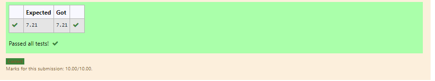

# DISTANCE-BETWEEN-TWO-POINTS

## AIM:
To write a python program to find the distance two 2 points
## ALGORITHM:
## Step 1:
Import math module

## Step 2:
Assign values as list

## Step 3:
Substitute the values in the distance formula 

## Step 4:
End the program
### PROGRAM:

```
#Program to find the distance between two points.
#Developed by: bharath
#RegisterNumber:21500449
import math
x=[10,4]
y=[6,2]
value=math.sqrt(((x[0]-x[1])**2)+((y[0]-y[1])**2))
print("{:.2f}".format(value))
```
  


### OUTPUT:



### RESULT:
Thus distance between two points are successfully executed